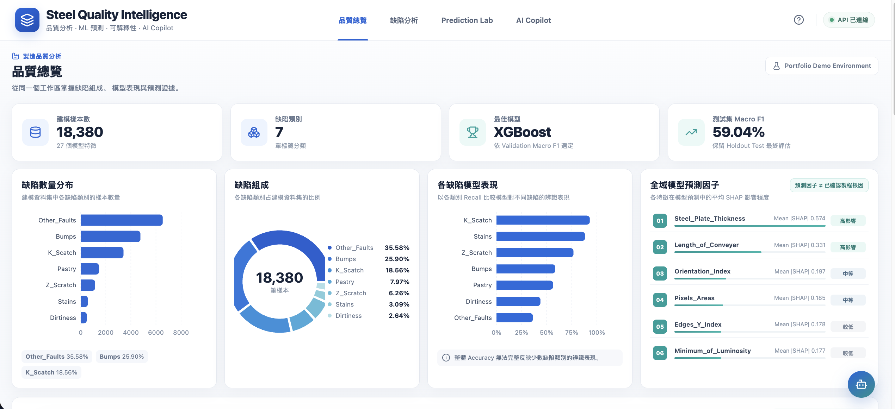
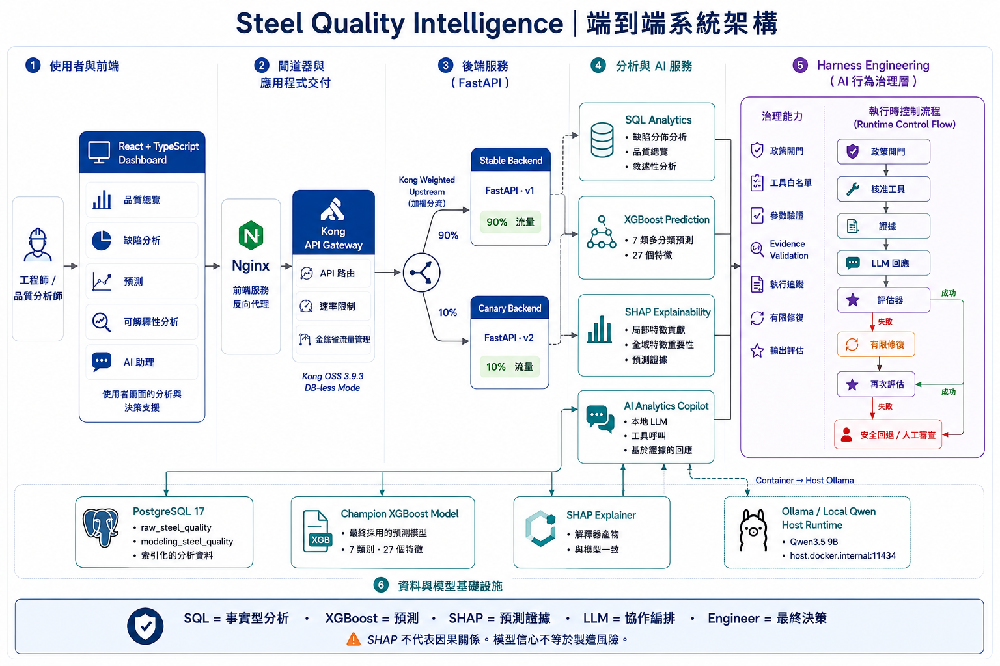
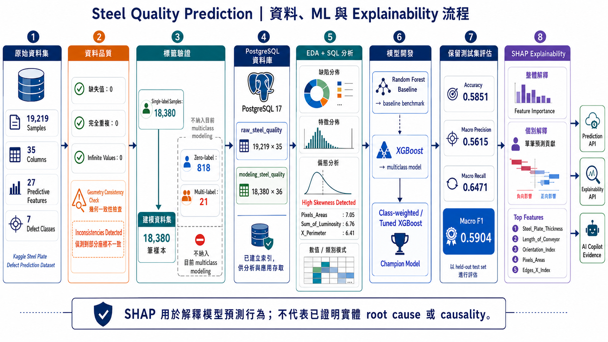
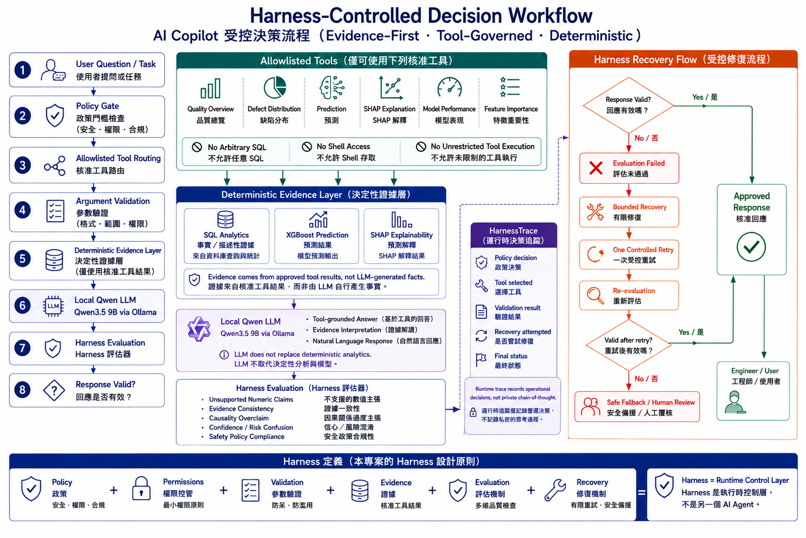
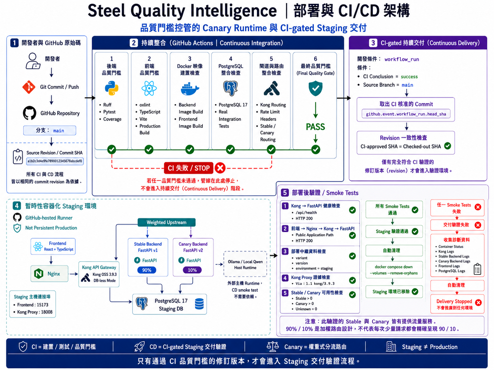

# Steel Quality Intelligence

製造業鋼材品質分析與 AI 決策支援系統，整合 **PostgreSQL、XGBoost、SHAP、FastAPI、React、Local Qwen、Harness Engineering、Kong Gateway、Docker 與 GitHub Actions**，建立從資料分析、模型預測、可解釋性、AI Copilot 到 Gateway、Canary Runtime、CI 與 CI-gated Staging Delivery 的完整工程流程。

本專案重點不只在模型預測，而是將 **Data、ML、LLM、AI Governance、Backend、Frontend、Deployment、CI/CD 與 Automated Testing** 串成一套可操作、可驗證、可追蹤的 AI Application PoC。

---

## 系統介面



Dashboard 提供：

- 鋼材品質總覽
- 缺陷類型分析
- XGBoost 品質預測
- SHAP 模型解釋
- AI Analytics Copilot
- 模型與系統狀態資訊

---

## 專案亮點

- 使用 **18,380 筆有效單一標籤樣本** 建立 7 類鋼材缺陷多分類模型
- 使用 **27 個製程與幾何特徵**進行 XGBoost Prediction
- 使用 **SHAP** 提供 Global / Local Explainability
- 使用 **PostgreSQL 17** 建立分析與應用共用 Data Layer
- 使用 **FastAPI** 提供 Analytics、Prediction、Explainability 與 AI Copilot API
- 使用 **Local Qwen3.5 9B + Ollama** 建立 AI Analytics Copilot
- 使用 **Harness Engineering** 控制 Tool Permission、Evidence Validation、Output Evaluation 與 Bounded Recovery
- 使用 **LoRA / QLoRA** 建立行為微調實驗，並透過 Locked Evaluation 與 Promotion Gate 決定是否推廣
- 使用 **Kong Gateway** 實作 Rate Limiting 與 Stable / Canary 90% / 10% Weighted Routing
- 使用 **Docker Compose + GitHub Actions** 建立 Backend、Frontend、PostgreSQL、Docker 與 Gateway Quality Gates
- 使用 **GitHub Actions Continuous Delivery**，在 CI 全部通過後自動驗證同一 commit 的 Ephemeral Staging Deployment
- AI 回答不直接取代 SQL、Model 或 Engineer Decision，而是以 deterministic evidence 為基礎提供 Decision Support

---

# 三層式架構

若用最基本的三層式架構理解，本專案可以拆成：

| 層級 | 本專案元件 | 主要責任 |
|---|---|---|
| **Presentation Layer｜呈現層** | React、TypeScript、Nginx | 提供 Dashboard、品質分析、模型預測、Explainability 與 AI Copilot 操作介面 |
| **Application Layer｜應用層** | Kong Gateway、FastAPI、XGBoost、SHAP、Local Qwen、Harness Engineering | 處理 API Routing、模型推論、分析工具、LLM 協作、Runtime Validation 與 AI Governance |
| **Data Layer｜資料層** | PostgreSQL、Model Artifacts、Evaluation Data | 儲存鋼材品質資料、模型產物、評估資料與可重現分析依據 |

簡化後的資料流：

```text
Engineer / User
      ↓
React Dashboard
      ↓
Nginx
      ↓
Kong Gateway
      ↓
FastAPI
      ↓
SQL Analytics / XGBoost / SHAP / AI Copilot
      ↓
PostgreSQL / Model Artifacts / Host Ollama
```

其中 AI Copilot 不直接取代 SQL Analytics 或 Machine Learning Model，而是透過 **Harness Engineering** 控制允許使用的工具、Evidence Source、輸出驗證與有限修復。

---

# 系統架構



完整系統由以下幾個主要部分組成：

### Frontend

使用 **React + TypeScript + Vite** 建立使用者介面，並由 **Nginx** 提供 Production Build 與 Reverse Proxy。

### API Gateway

使用 **Kong OSS 3.9.3**，採 **DB-less Mode**，處理：

- API Routing
- Rate Limiting
- Stable / Canary Weighted Routing
- Gateway Request Metadata

### Backend

使用 **FastAPI** 提供統一 Application Layer，包括：

- Quality Analytics API
- Prediction API
- SHAP Explainability API
- AI Copilot API
- Deployment Metadata API

### Analytics & ML

```text
SQL        → factual / descriptive analytics
XGBoost    → predictive result
SHAP       → predictive explanation
LLM        → orchestration and interpretation
Engineer   → final decision
```

### Local LLM Runtime

```text
Ollama
└── Qwen3.5 9B
```

FastAPI Container 透過：

```text
host.docker.internal:11434
```

呼叫 Host Runtime 上的 Ollama。

---

# Data & ML Pipeline



## Dataset

使用 Kaggle Steel Plate Defect Prediction Dataset。

| 項目 | 數量 |
|---|---:|
| Raw Samples | 19,219 |
| Columns | 35 |
| Predictive Features | 27 |
| Defect Classes | 7 |

Label Validation 後：

| 類型 | 數量 | Modeling 使用 |
|---|---:|---|
| Single-label | 18,380 | Yes |
| Zero-label | 818 | No |
| Multi-label | 21 | No |

最終 Modeling Dataset：

```text
18,380 samples
27 predictive features
7 defect classes
```

7 類缺陷：

```text
Bumps
Dirtiness
K_Scatch
Other_Faults
Pastry
Stains
Z_Scratch
```

---

## Data Quality

| 檢查項目 | 結果 |
|---|---:|
| Missing Values | 0 |
| Exact Duplicates | 0 |
| Infinite Values | 0 |
| x_min > x_max | 48 |
| y_min > y_max | 18 |

資料中雖然沒有 Missing、Duplicate 或 Infinite Values，但仍觀察到部分 Geometry Consistency Issues，因此流程中保留獨立的 Geometry Consistency Check。

---

# PostgreSQL Data Layer

使用 **PostgreSQL 17** 作為 Analytics 與 Application 的主要資料層。

```text
raw_steel_quality
19,219 rows × 35 columns

modeling_steel_quality
18,380 rows × 36 columns
```

索引：

```text
id          → UNIQUE
defect_type → INDEX
```

Application Container 透過 Docker internal network：

```text
postgres:5432
```

存取資料庫。

---

# SQL Analytics

| Defect Type | Percentage |
|---|---:|
| Other_Faults | 35.58% |
| Bumps | 25.90% |
| K_Scatch | 18.56% |
| Pastry | 7.97% |
| Z_Scratch | 6.26% |
| Stains | 3.09% |
| Dirtiness | 2.64% |

SQL Analytics 負責 factual / descriptive information，例如 Modeling Samples、Defect Distribution、Defect Class Counts 與 Quality Overview。

LLM 不自行產生這些數字，而是透過 allowlisted tools 取得 deterministic evidence。

---

# Model Development

## Random Forest Baseline

```text
Accuracy       0.5992
Macro F1       0.5273
Weighted F1    0.5840
```

## XGBoost Baseline

```text
Accuracy       0.5967
Macro F1       0.5496
Weighted F1    0.5858
```

## Class-weighted XGBoost

```text
Macro Recall   0.6124
Macro F1       0.5656
```

部分 Class Weight：

```text
Dirtiness      5.42
Stains         4.62
Z_Scratch      2.28
Pastry         1.79
Other_Faults   0.40
```

---

# Champion Model

| Metric | Score |
|---|---:|
| Accuracy | 0.5851 |
| Macro Precision | 0.5615 |
| Macro Recall | 0.6471 |
| **Macro F1** | **0.5904** |
| Weighted F1 | 0.5798 |

本專案保留真實 evaluation result，將模型定位為 **manufacturing decision-support PoC**，而不是包裝成高準確率 Demo。

---

# SHAP Explainability

SHAP 用來解釋模型預測行為。

Global SHAP Top Features：

| Feature | Mean Absolute SHAP |
|---|---:|
| Steel_Plate_Thickness | 0.5742 |
| Length_of_Conveyer | 0.3306 |
| Orientation_Index | 0.1971 |
| Pixels_Areas | 0.1845 |
| Edges_Y_Index | 0.1780 |

Local Explanation 則針對單筆 prediction 顯示 feature contribution。

> SHAP 用於解釋 model prediction behavior，不代表已證明 physical root cause 或 causality。

因此系統禁止將 `high SHAP value` 直接改寫成 `root cause`、`physical cause` 或 `manufacturing cause`。

---

# AI Analytics Copilot

AI Analytics Copilot 使用 **Ollama + Qwen3.5 9B**。

LLM 的角色：

- 理解 Engineer Question
- 選擇 Allowlisted Tool
- 取得 deterministic evidence
- 將 evidence 轉換成自然語言
- 協助工程師解讀 prediction 與 explainability

Allowlisted Tools：

```text
Quality Overview
Defect Distribution
Prediction
SHAP Explanation
Model Performance
Feature Importance
```

禁止：

```text
Arbitrary SQL
Shell Access
Unrestricted Tool Execution
```

---

# Harness Engineering



本專案將 Harness Engineering 定義為：

> 控制 LLM 可以做什麼、可以使用哪些工具、如何驗證 evidence、如何評估 output，以及失敗後如何安全 recovery 的 runtime control layer。

核心組件：

```text
Policy
Permissions
Validation
Evidence
Evaluation
Recovery
```

Runtime Flow：

```text
User Question
      ↓
Policy Gate
      ↓
Allowlisted Tool Routing
      ↓
Argument Validation
      ↓
Deterministic Evidence
      ↓
Local Qwen LLM
      ↓
Harness Evaluator
      ↓
Response Valid?
```

第一次 evaluation 成功：

```text
Approved Response
→ Engineer / User
```

失敗：

```text
Bounded Recovery
→ One Controlled Retry
→ Re-evaluation
```

Retry 仍失敗：

```text
Safe Fallback
→ Human Review
```

Harness Evaluator 檢查：

```text
Unsupported Numeric Claims
Evidence Consistency
Causality Overclaim
Confidence / Risk Confusion
Safety Policy Compliance
```

HarnessTrace 記錄：

```text
Policy decision
Tool selected
Validation result
Recovery attempted
Final status
```

它記錄的是 operational runtime trace，不是 private chain-of-thought。

---

# LoRA Fine-tuning & Model Governance


本專案另外建立 LoRA / QLoRA behavior fine-tuning 實驗，目的不是單純追求 lower validation loss，而是驗證 Fine-tuning 是否真的改善 production-relevant behavior。

## SFT Dataset

```text
120 Behavioral Samples
5 Behavior Categories

Train       95
Validation  25
```

Dataset Freeze Manifest：

```text
SHA-256
244addb71d03e26f445293045442fb6d2ad7834a93f56f2484daf9d051322a01
```

## QLoRA Training

```text
Qwen3-4B-Instruct-2507-4bit
MLX-LM QLoRA
Apple Silicon Local Training
200 iterations
```

Validation Loss：

```text
6.850
  ↓
2.623
```

Step 150 最終依 Development Behavioral Evaluation 被選為 candidate；Step 200 雖然 validation loss 更低，但觀察到 behavior regression。

---

# Locked Evaluation

```text
20 New Cases
4 Cases per Category
```

Locked Evaluation Manifest：

```text
SHA-256
20929f469c252e1ce5e15ad2e971ddd4510b8274ddce015ee097307a11361e12
```

這組資料不參與 checkpoint selection 或 tuning。

## Four-way Evaluation

| Configuration | Behavioral Automated Score |
|---|---:|
| Base Only | 40% |
| LoRA Only | 35% |
| Base + Harness | 30% |
| LoRA + Harness | 25% |

> 以上是 locked evaluation set 上的 automated behavioral score，不是 Accuracy、F1 或一般模型 benchmark。

重要觀察：

```text
LoRA Grounding
→ Improved

LoRA Security
→ Regressed

Harness Input Blocking
→ Verified

LoRA + Harness Bounded Recovery
→ Verified
```

---

# Model Promotion Decision

| Criteria | Result |
|---|---|
| Overall Behavioral Performance | ❌ |
| Grounding | ✅ |
| Security | ❌ |
| No Major Regression | ❌ |
| Runtime Harness Compatibility | ✅ |

Final Decision：

```text
REJECT
LoRA v1 NOT PROMOTED
```

原因：

> Security regression outweighed isolated grounding improvement.

LoRA v1 僅保留為 Evaluation / Research Only。

核心結論：

> Lower validation loss ≠ safer production model.

---

# API & Application

FastAPI 主要 endpoints：

```text
/health
/deployment
/quality/overview
/explain/global
AI Copilot / Tool APIs
```

`/quality/overview`：

```text
modeling_samples = 18,380
defect_classes   = 7
champion_model   = XGBoost
test_macro_f1    = 0.5904
feature_count    = 27
```

---

# Deployment & Gateway



Docker Compose 管理：

```text
PostgreSQL
FastAPI Stable
FastAPI Canary
React + Nginx
Kong Gateway
```

使用 **Kong OSS 3.9.3 / DB-less Mode**，功能包括：

- API Routing
- Rate Limiting
- Weighted Upstream
- Stable / Canary Routing

Kong Admin API `8001` 僅 expose 於 Docker network。

---

# Canary Deployment

```text
Stable
variant = stable
version = v1

Canary
variant = canary
version = v2
```

Kong Weighted Upstream：

```text
Stable    90%
Canary    10%
```

100 Requests 驗證：

```text
Stable     90
Canary     10
Unknown     0
```

> 90% / 10% 為 Weighted Routing 設計；少量 Smoke Test 的責任是確認 Stable 與 Canary 都能提供服務，不要求每次少量請求都精確呈現 90 / 10。

---

# Gateway Integration Tests

驗證：

```text
Kong → FastAPI Health Routing
Kong Proxy Headers
Rate Limit Headers
Frontend → Nginx → Kong
Deployment Metadata
Stable / Canary Routing
Unknown Route Rejection
```

結果：

```text
7 passed
```

---

# Continuous Integration

GitHub Actions Quality Gates：

```text
Backend Quality Gate
Frontend Quality Gate
PostgreSQL Integration
Docker Build Validation
Gateway Integration
Final Quality Gate
```

Final CI：

```text
Backend Quality Gate       PASS
Frontend Quality Gate      PASS
PostgreSQL Integration     PASS
Docker Build Validation    PASS
Gateway Integration        PASS
Final Quality Gate         PASS
```

Backend：

```text
Ruff
Pytest
Coverage
```

Frontend：

```text
oxlint
TypeScript
Vite Production Build
```

---

# Continuous Delivery

本專案使用獨立的 GitHub Actions `Continuous Delivery` workflow。

CD 只在下列條件成立時執行：

```text
CI workflow completed
CI Conclusion = success
Source Branch = main
```

流程：

```text
Push to main
      ↓
Continuous Integration
      ↓
Final Quality Gate PASS
      ↓
Continuous Delivery
      ↓
Checkout CI-approved Commit
      ↓
Revision Consistency Check
      ↓
Ephemeral Containerized Staging Environment
      ↓
Post-deployment Smoke Tests
      ↓
Staging Delivery Verification PASSED
      ↓
Automatic Cleanup
```

CD 使用：

```text
github.event.workflow_run.head_sha
```

checkout 觸發 CI 的同一個 commit，避免「CI 驗證版本」與「CD 交付版本」不一致。

Staging Environment 位於 **GitHub-hosted Runner**，屬於暫時性的 containerized validation environment，而不是 Persistent Production Deployment。

Post-deployment Smoke Tests 驗證：

```text
Kong → FastAPI /api/health
Frontend → Nginx → Kong → FastAPI
Deployment Metadata
Kong Proxy Evidence
Stable Backend Availability
Canary Backend Availability
```

成功條件：

```text
Health = HTTP 200
Environment = staging
Kong Via Header = verified
Stable > 0
Canary > 0
Unknown = 0
```

失敗時：

```text
Delivery Validation FAILED
      ↓
Collect Diagnostics
      ↓
Automatic Cleanup
      ↓
Delivery Stopped
```

Diagnostics 包括：

```text
Container Status
Kong Logs
Stable Backend Logs
Canary Backend Logs
Frontend Logs
PostgreSQL Logs
```

無論成功或失敗，最後都會執行：

```bash
docker compose down   --volumes   --remove-orphans
```

因此目前 CD 的正確定位是：

> **CI-gated ephemeral staging delivery validation，不是 persistent production deployment。**

---

# Automated Testing

CI-safe tests：

```text
139 passed
26 deselected
```

Gateway Integration：

```text
7 passed
```

External-runtime tests 透過 pytest marker 分離：

```text
integration
docker
ollama
```

---

# Security & AI Governance

主要安全設計：

```text
Tool Allowlist
No Arbitrary SQL
No Shell Access
Argument Validation
Prompt Injection Gate
Evidence Validation
Output Evaluation
Bounded Recovery
Safe Fallback
Runtime Trace
Kong Rate Limiting
Internal-only Kong Admin API
CI Quality Gates
CI-approved Revision Validation
```

治理原則：

```text
SQL       = factual / descriptive analytics
XGBoost   = prediction
SHAP      = predictive explanation
LLM       = orchestration / interpretation
Engineer  = final decision
```

限制：

```text
SHAP ≠ Causality
Model Confidence ≠ Manufacturing Risk
LLM Response ≠ Deterministic Ground Truth
Staging ≠ Production
```

---

# Tech Stack

| Layer | Technology |
|---|---|
| Frontend | React 19、TypeScript、Vite、Recharts |
| Web Server | Nginx |
| API Gateway | Kong OSS 3.9.3 |
| Backend | Python 3.12、FastAPI、Uvicorn |
| Database | PostgreSQL 17 |
| Data | pandas、NumPy |
| ML | scikit-learn、XGBoost |
| Explainability | SHAP |
| Local LLM | Qwen3.5 9B、Ollama |
| Fine-tuning | QLoRA、MLX-LM |
| AI Governance | Harness Engineering |
| Testing | Pytest |
| Static Analysis | Ruff、oxlint |
| Container | Docker、Docker Compose |
| CI/CD | GitHub Actions |

---

# Repository Structure

```text
Steel_Quality_Assisstant/
│
├── .github/
│   └── workflows/
│       ├── ci.yml
│       └── cd.yml
├── src/
├── frontend/
├── data/
├── adapters/
├── reports/
├── tests/
├── infra/
├── docker/
├── scripts/
│   ├── ci/
│   └── cd/
│       └── deploy_staging.sh
├── docs/
│   └── images/
│       ├── dashboard.png
│       ├── system_architecture.png
│       ├── ml_explainability_workflow.png
│       ├── harness_decision_workflow.png
│       ├── lora_governance.png
│       └── deployment_cicd_architecture.png
├── Dockerfile
├── docker-compose.yml
├── docker-compose.gateway.yml
├── requirements.txt
├── requirements-dev.txt
└── README.md
```

---

# Quick Start

## 1. Clone Repository

```bash
git clone https://github.com/yunyahuang49343827-dot/Steel_Quality_Assisstant.git
cd Steel_Quality_Assisstant
```

## 2. 建立環境變數

建立 `.env`，可參考 `.env.example`。

## 3. 啟動 Ollama

```bash
ollama pull qwen3.5:9b
ollama list
```

## 4. 啟動基本 Docker Stack

```bash
docker compose up --build -d
```

Frontend：

```text
http://localhost:5173
```

## 5. 啟動 Kong + Canary Stack

```bash
docker compose   -f docker-compose.yml   -f docker-compose.gateway.yml   up --build -d
```

Kong Proxy：

```text
http://localhost:8008
```

## 6. Health Check

```bash
curl http://localhost:8008/api/health
curl http://localhost:8008/api/deployment
```

## 7. 執行 CI-safe Tests

```bash
pytest -m "not ollama and not integration and not docker"
```

## 8. Gateway Integration Tests

```bash
pytest tests/integration/test_gateway.py   -m "integration and docker"   -v
```

---

# Current Limitations

本專案定位為 **production-oriented engineering PoC**。

目前仍有以下 production gaps：

- Kong Rate Limiting 目前使用 `policy: local`
- Production 仍需 Trusted Proxy / Real Client IP 設定
- 尚未整合 Prometheus、Grafana、Distributed Tracing
- Secrets 目前以 environment variables / `.env` 管理
- Ollama 目前運行於 Host Runtime
- Canary 尚未建立 automated metric-based promotion / rollback
- Continuous Delivery 目前是 GitHub-hosted Runner 上的 Ephemeral Staging Validation，並非 Persistent Production Deployment

---

# Project Takeaways

本專案建立完整 AI Application Engineering Workflow：

```text
Raw Data
→ Data Quality
→ PostgreSQL
→ SQL Analytics
→ Machine Learning
→ SHAP Explainability
→ FastAPI
→ AI Copilot
→ Harness Engineering
→ Model Governance
→ Docker
→ Kong Gateway
→ Canary Runtime
→ CI Quality Gates
→ CI-gated Staging Delivery
→ Post-deployment Validation
```

核心設計原則：

> **Deterministic evidence first, LLM orchestration second, human decision final.**

在模型治理方面，本專案刻意保留 LoRA v1 的失敗結果：

> Fine-tuning 並不代表模型一定更好；即使 validation loss 降低，只要 behavioral 或 security evidence 不符合 Promotion Criteria，就不應推廣到 application runtime。

在 Deployment Governance 方面：

> 只有通過 CI Quality Gate 的相同 commit revision，才能進入 Staging Delivery Validation；若 Smoke Test 失敗，Delivery 立即停止並自動清理暫時環境。

**不只建立 AI 功能，也建立一套能控制、驗證、測試、治理與交付 AI 功能的工程架構。**
